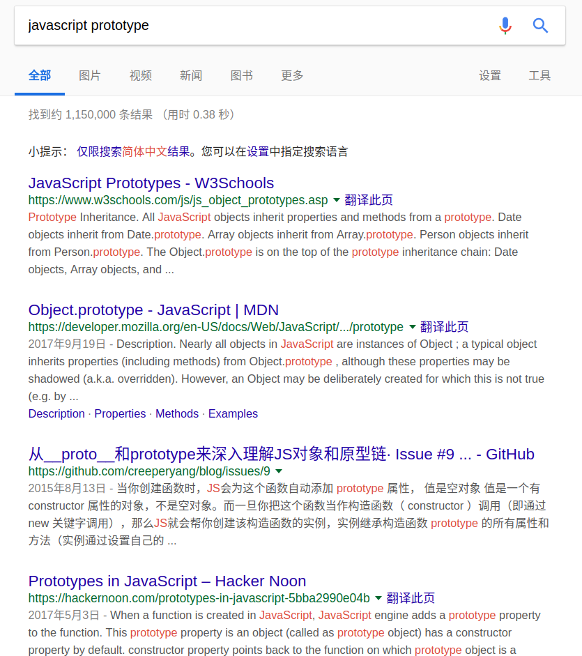
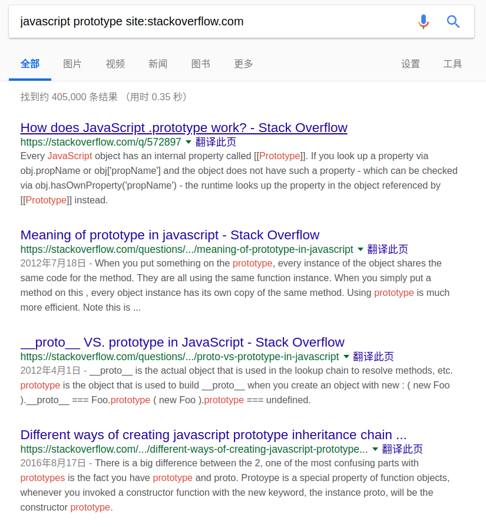
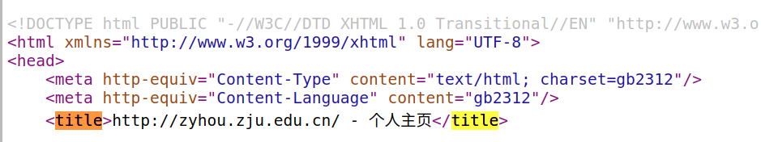
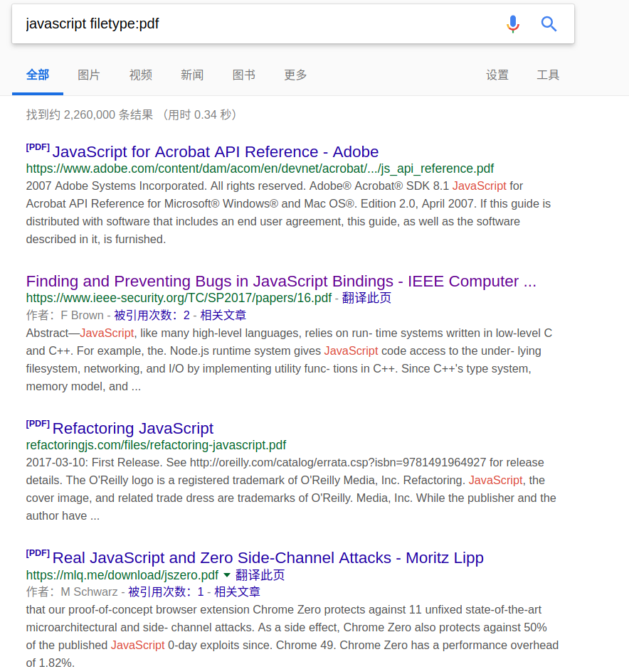
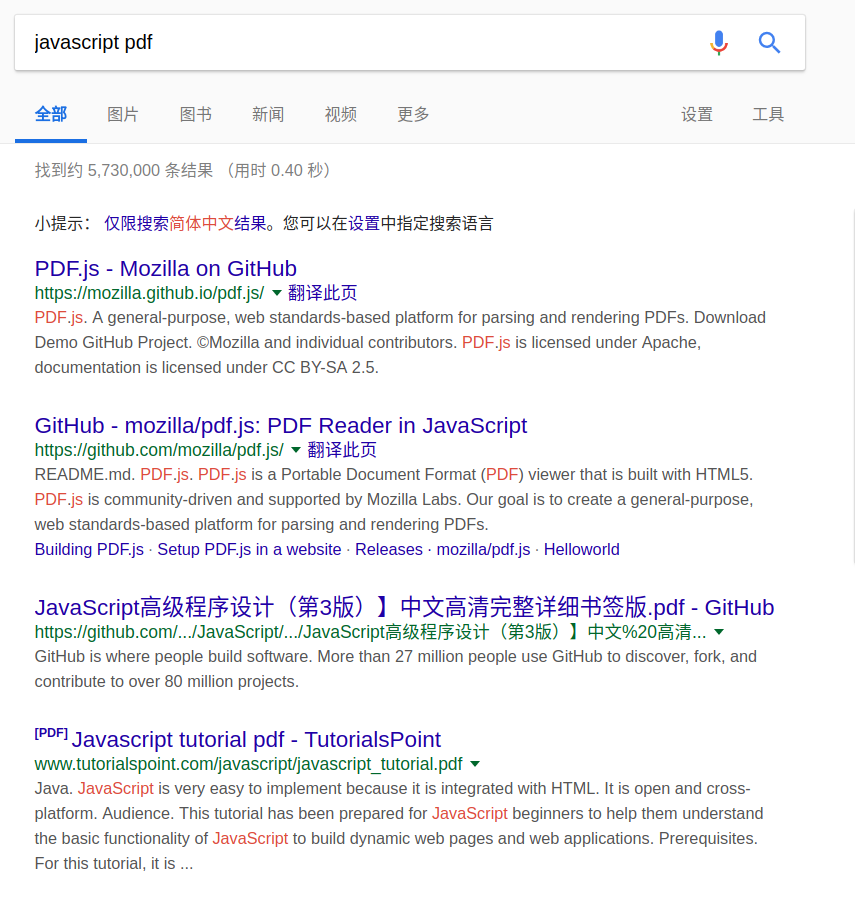

# Intro
This repo is used to record some search skills for googling.

# advanced search skills

The skills to be introduced may be roughly divided into three categories: location-directed, content-directed and others.

## 1. location-directed 
In this way, we can filter pages according the location. specifically, we can use the site and url of a page
to control the location.

### 1.1 site
By its very name, we can tune our search to make result limited to some specific location and by location, 
I mean the domain of web pages. In google, we can use **site** keyword to achieve this goal.

For example, we wanna search pages which contain **javascript prototype**, we can type search like this:

As we can see in the picture above, the result pages do contain **javasript and/or prototype**, but 
we now want pages only from some domain, say ***stackoverflow.com***, for pages from this domain are more likely
have high-quality contents we may need, so we can tune our search like this:

So the result pages now are all from the same domain of ***stackoverflow.com***.

### 1.2 url
We can further do something on the url of pages. And in google we have two related operator: inurl and allinurl.

#### 1.2.1 inurl

For example, we wanna the url of pages containing **zju and/or cs** , so we can construct our search like this:

#### 1.2.2 allinurl
The key difference between inurl and allinurl is that the latter one requires all the keywords be contained in url, while
the former require at least one of keywords represent in url. The following picture shows the result with using **allinurl**:

As far as I know, we can tune the site and url of pages to make result pages more closer to what we expected as to the 
location of pages.

## 2. content-directed 
In this way, we can tune our search according the title, body, filetype of a result page. And in google we have corresponding
keyword **intitle, allintitle, intext, allintext and filetype** to achieve these goals respectively.

### 2.1 title
Search pages whose titles matching some keyword. 

#### 2.1.1 intitle
For example, we wanna search pages whose titles containing the ***zju*** keyword, we can do like this:

And we can check the html source the see whether the title truly contains the ***zju*** keyword, as we can see the following 
picture, it does.

**Notice: the words are case-insensitive.**

#### 2.1.2 allintitle
As I mentioned earlier, the operators prefixed with **all** require all the keywords exist simultaneously.

For example, if we wanna search pages whose titles containing the ***zju*** keyword, we can do like this:

Similarly, we can check the html source shown below:

### 2.2 intext
Search for body part of a html page.

#### 2.2.1 intext
For example, we wanna search pages whose body contains ***google search skills***, we can write this:

#### 2.2.2 allintext
You may notice that I also visited the fourth result in the above picture. And I found that the fourth 
doesn't contain the ***skills*** keyword, this is not surprising, for **intext** only require at least
one of the keyword.

If we want to body of pages contain all the three keywords, we can use **allintext**:

And if we want the three keywords contained in body of pages continuously, we can use double quotes, which will
be introduced later:

### 2.3 filetype 
Find and download different kinds of documents.

For example, we wanna search some pdf files which contain the **javascript** keyword, we would type
search like this:

but if we don't use the filetype operator and just type **javascript pdf**, then we are likely not get expected results:

## 3. others
There are some operators can be used both in location-directed and content-directed search, like **minus sign** and
**double quotes**.

### 3.1 minus sign
Eliminate irrelevant results.
### 3.2 double quotes,
Search an exact phrase.

# Caveats
> 
> - every word in a query matters
> - word order matters
> - words are case-insensitive
> - never trust one source

# resources
For more advanced search skills, you can visit the following two links.
- [Search Smarter: 30+ Google Search Tricks You Might Not Already Know][1](blog)
- [Google Search Education][2](videos)

[1]:https://zapier.com/blog/advanced-google-search-tricks
[2]:https://www.google.com/intl/en-us/insidesearch/searcheducation/
